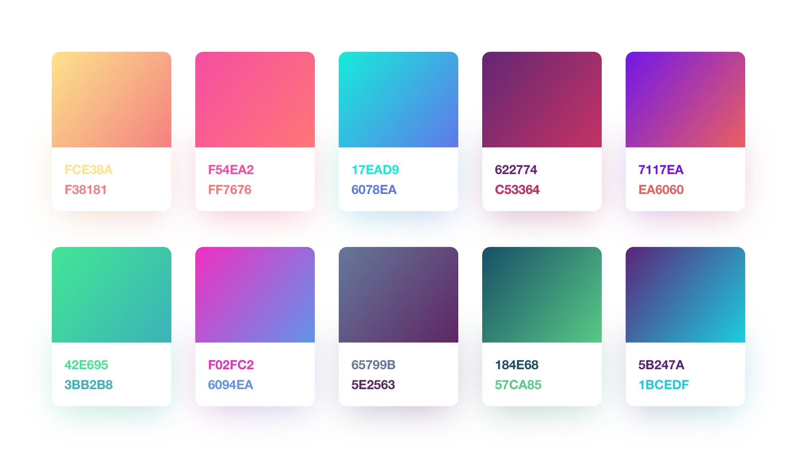

# Pastel
🎨 Gradient animation effect like Instagram


[](https://travis-ci.org/cruisediary/Pastel)
[](http://cocoapods.org/pods/Pastel)
[](http://cocoapods.org/pods/Pastel)
[](http://cocoapods.org/pods/Pastel)
[](https://github.com/Carthage/Carthage)


## Example
```swift
override func viewDidLoad() {
    super.viewDidLoad()

    let pastelView = PastelView(frame: view.bounds)

    // Custom Direction
    pastelView.startPastelPoint = .bottomLeft
    pastelView.endPastelPoint = .topRight

    // Custom Duration
    pastelView.animationDuration = 3.0

    // Custom Color
    pastelView.setColors([UIColor(red: 156/255, green: 39/255, blue: 176/255, alpha: 1.0),
                          UIColor(red: 255/255, green: 64/255, blue: 129/255, alpha: 1.0),
                          UIColor(red: 123/255, green: 31/255, blue: 162/255, alpha: 1.0),
                          UIColor(red: 32/255, green: 76/255, blue: 255/255, alpha: 1.0),
                          UIColor(red: 32/255, green: 158/255, blue: 255/255, alpha: 1.0),
                          UIColor(red: 90/255, green: 120/255, blue: 127/255, alpha: 1.0),
                          UIColor(red: 58/255, green: 255/255, blue: 217/255, alpha: 1.0)])

    pastelView.startAnimation()
    view.insertSubview(pastelView, at: 0)
}
```

## 🎨 Customize Gradient Colors
#### Designed by Alexander Zaytsev, https://dribbble.com/anwaltzzz


To run the example project, clone the repo, and run `pod install` from the Example directory first.

## Requirements
Pastel is written in Swift 4. iOS 8.0+ Required

## Installation

Pastel is available through [CocoaPods](http://cocoapods.org) or [Carthage](https://github.com/Carthage/Carthage).

### Cocoapods
```ruby
pod "Pastel"
```

### Carthage
```
github "cruisediary/Pastel" ~> 0.5.0
```

## Example
- [Passcode](https://github.com/cruisediary/Passcode): A simple Passcode application using RxSwift, ReactorKit, IGListKit with Pastel

## Author

cruz, cruzdiary@gmail.com

## License

Pastel is available under the MIT license. See the LICENSE file for more info.
